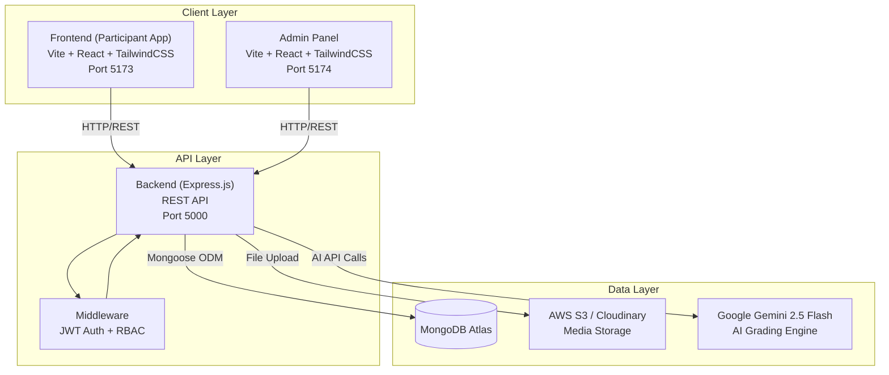
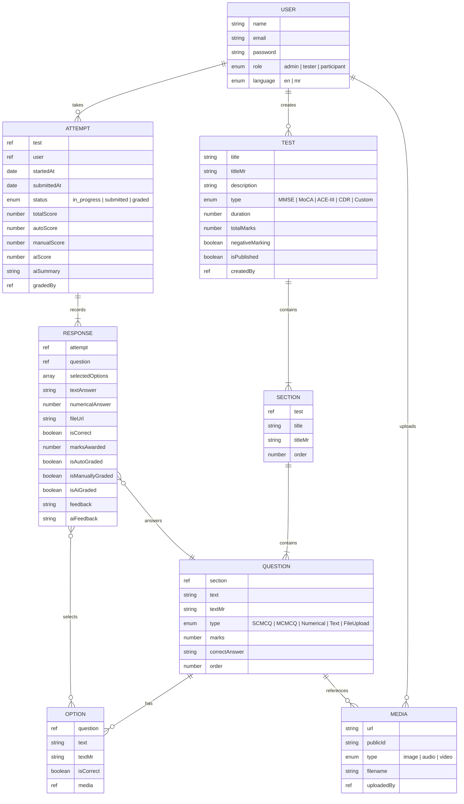
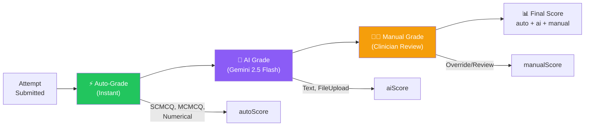
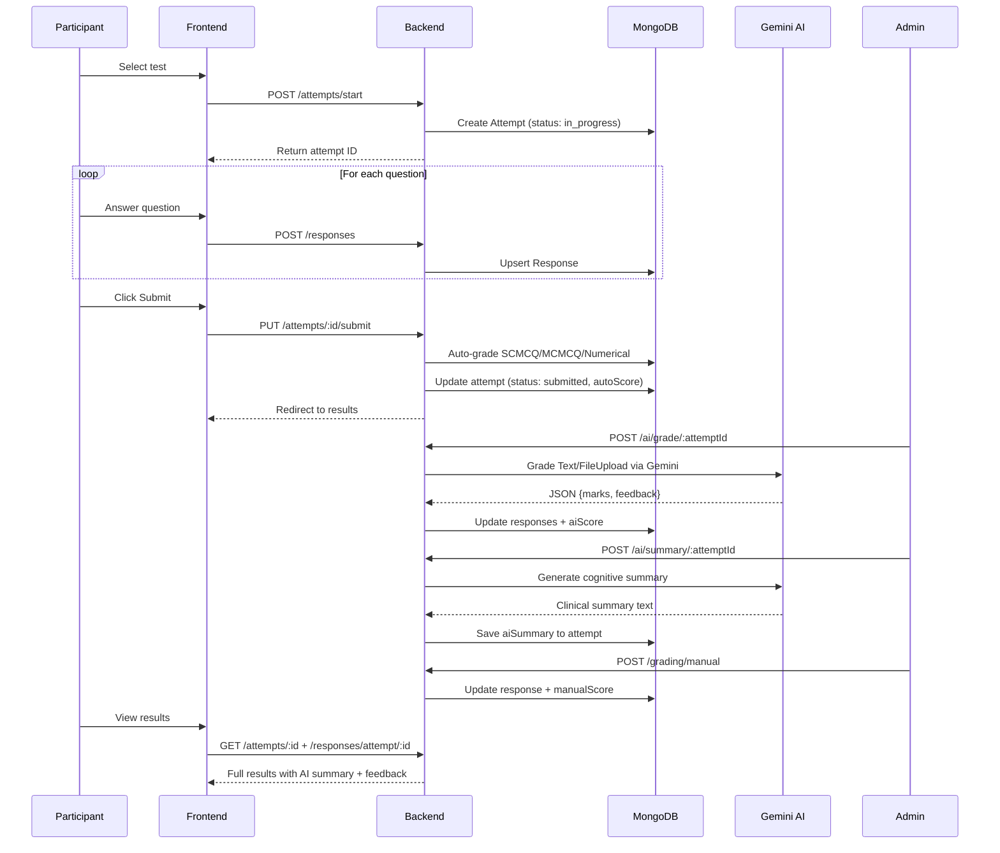

# 🧠 Evalix — Project Walkthrough

> **Evalix** is an AI-powered Clinical Cognitive Screening Platform designed to digitize, administer, and intelligently evaluate standardized neuropsychological assessments.

---

## 1. Project Overview

Evalix transforms traditional pen-and-paper cognitive screening tests into an interactive digital platform. It supports **four internationally recognized clinical assessments** (MMSE, MoCA, ACE-III, CDR), uses **Google Gemini 2.5 Flash AI** for automated grading of subjective responses, and provides clinicians with AI-generated cognitive summaries — all through a modern, dark-themed SaaS interface.

### Why Evalix Matters

| Problem | Evalix Solution |
|---|---|
| Paper-based tests are slow and error-prone | Digital test-taking with auto-grading |
| Subjective answers require expert review | AI-powered grading via Gemini |
| Results lack clinical context | AI-generated cognitive summaries |
| No centralized patient data | Cloud-based attempt tracking & analytics |
| Limited accessibility for regional users | Bilingual support (English + Marathi) |

---

## 2. System Architecture

Evalix follows a **three-tier architecture** with clear separation of concerns:



### Tech Stack

| Layer | Technology | Purpose |
|---|---|---|
| **Frontend** | React 18 + Vite | Participant-facing SPA |
| **Admin** | React 18 + Vite | Clinician/Admin dashboard |
| **Styling** | TailwindCSS | Utility-first CSS framework |
| **Backend** | Express.js (Node.js) | REST API server |
| **Database** | MongoDB (Mongoose ODM) | Document store for all data |
| **Auth** | JWT + bcryptjs | Token-based authentication |
| **AI Engine** | Google Gemini 2.5 Flash | Subjective response grading & summaries |
| **File Storage** | AWS S3 + Cloudinary | Media & drawing uploads |
| **i18n** | Custom LangContext | English + Marathi bilingual support |

---

## 3. Database Schema Architecture

The database uses **8 interconnected MongoDB collections** modeled with Mongoose:



### Schema Details

#### 1. User Schema — [User.js](file:///home/dj/Drive2/Evalix/backend/models/User.js)

Manages identity and access control with three roles:
- **admin** — Full access: create tests, manage users, grade attempts
- **tester** — Can grade attempts, trigger AI grading
- **participant** — Can take published tests and view results

#### 2. Test Schema — [Test.js](file:///home/dj/Drive2/Evalix/backend/models/Test.js)

The root entity for each cognitive assessment. Key fields:
- `type` enum maps to clinical test standards (MMSE, MoCA, ACE-III, CDR, Custom)
- `negativeMarking` and `negativeMarks` support penalty-based scoring
- `isPublished` controls visibility to participants
- Bilingual fields (`titleMr`, `descriptionMr`) for Marathi translations

#### 3. Section Schema — [Section.js](file:///home/dj/Drive2/Evalix/backend/models/Section.js)

Groups questions into logical cognitive domains (e.g., Orientation, Memory, Language). The `order` field controls presentation sequence.

#### 4. Question Schema — [Question.js](file:///home/dj/Drive2/Evalix/backend/models/Question.js)

Supports **5 question types** to match clinical assessment needs:

| Type | Use Case | Grading |
|---|---|---|
| `SCMCQ` | Single-choice MCQ | Auto-graded |
| `MCMCQ` | Multi-choice MCQ | Auto-graded (partial credit) |
| `Numerical` | Exact number match | Auto-graded |
| `Text` | Free-text responses | AI + Manual graded |
| `FileUpload` | Drawings, recordings | AI vision + Manual graded |

#### 5. Option Schema — [Option.js](file:///home/dj/Drive2/Evalix/backend/models/Option.js)

MCQ answer choices with `isCorrect` flag for auto-grading, optional media attachments, and bilingual text.

#### 6. Media Schema — [Media.js](file:///home/dj/Drive2/Evalix/backend/models/Media.js)

Handles image, audio, and video stimulus materials used in questions (e.g., pictures for naming tasks, clock images for drawing tasks).

#### 7. Attempt Schema — [Attempt.js](file:///home/dj/Drive2/Evalix/backend/models/Attempt.js)

Tracks a participant's test session with a **triple-score breakdown**:
- `autoScore` — From auto-graded MCQ/Numerical questions
- `aiScore` — From Gemini AI grading of Text/FileUpload
- `manualScore` — From clinician manual review
- `aiSummary` — AI-generated clinical cognitive summary

#### 8. Response Schema — [Response.js](file:///home/dj/Drive2/Evalix/backend/models/Response.js)

Stores each answer with a unique compound index `(attempt, question)`. Tracks grading source (`isAutoGraded`, `isAiGraded`, `isManuallyGraded`) and both AI and manual feedback.

---

## 4. Cognitive Screening Tests — Theory & Clinical Importance

### 4.1 MMSE — Mini-Mental State Examination

> **30-point screening tool | 12 questions | ~15 minutes**

#### What It Is
The MMSE (Folstein et al., 1975) is the most widely used cognitive screening instrument worldwide. It provides a quick, standardized assessment of cognitive function across five domains.

#### Cognitive Domains Tested

| Domain | Points | What It Measures |
|---|---|---|
| **Orientation** | 10 | Awareness of time (year, season) and place (country, city) |
| **Registration** | 3 | Immediate memory — ability to encode 3 words |
| **Attention & Calculation** | 5 | Serial 7s subtraction (100 → 93 → 86 → 79 → 72 → 65) |
| **Recall** | 3 | Short-term memory — recalling the 3 registered words |
| **Language** | 8 | Naming objects, repeating phrases, following commands |
| **Visual Construction** | 1 | Copying intersecting pentagons |

#### Score Interpretation
- **24–30**: Normal cognition
- **18–23**: Mild cognitive impairment
- **0–17**: Severe cognitive impairment

#### Clinical Importance
- Gold standard for initial dementia screening
- Used in clinical trials as an inclusion/exclusion criterion
- Tracks cognitive decline over time
- Quick to administer — suitable for primary care settings

#### In Evalix
Questions include time/place orientation (MCQ + Numerical), word registration/recall (Text — AI graded), serial subtraction (Numerical — auto-graded), object naming from images (MCQ with media), sentence repetition (Text), and shape copying (FileUpload with canvas drawing — AI vision grading).

---

### 4.2 MoCA — Montreal Cognitive Assessment

> **30-point screening tool | 13 questions | ~15 minutes**

#### What It Is
The MoCA (Nasreddine et al., 2005) was designed to detect **Mild Cognitive Impairment (MCI)** — the stage between normal aging and dementia that the MMSE often misses. It is more sensitive than the MMSE for early cognitive decline.

#### Cognitive Domains Tested

| Domain | Points | What It Measures |
|---|---|---|
| **Visuospatial/Executive** | 5 | Trail-making, cube copying, clock drawing |
| **Naming** | 3 | Identifying animals from pictures |
| **Attention** | 6 | Digit span, serial subtraction, sustained attention |
| **Language** | 3 | Sentence repetition, verbal fluency |
| **Abstraction** | 2 | Finding similarities between concepts |
| **Delayed Recall** | 5 | Recalling words after a delay |
| **Orientation** | 6 | Date, day, month, year, place, city |

#### Score Interpretation
- **26–30**: Normal cognition
- **18–25**: Mild cognitive impairment
- **10–17**: Moderate cognitive impairment
- **< 10**: Severe cognitive impairment

#### Clinical Importance
- **More sensitive than MMSE** for detecting early/mild cognitive impairment
- Tests executive function — critical for detecting frontotemporal dementia and vascular cognitive impairment
- Widely used in Parkinson's disease cognitive assessment
- Clock Drawing Test (CDT) within MoCA is itself a powerful screening sub-test

#### In Evalix
Includes 3D cube copying and clock drawing (FileUpload — AI vision analyzes accuracy, proportions, spatial relationships), animal naming from images (MCQ with media), serial subtraction (Numerical), abstraction questions like "How are a ruler and a watch similar?" (Text — AI evaluates conceptual reasoning), and verbal fluency (Text — AI assesses word generation).

---

### 4.3 ACE-III — Addenbrooke's Cognitive Examination III

> **100-point comprehensive battery (scaled to 40 in Evalix) | 12 questions | ~25 minutes**

#### What It Is
The ACE-III (Hsieh et al., 2013) is a comprehensive cognitive assessment battery that provides detailed sub-domain scores, enabling **differential diagnosis** between Alzheimer's disease and frontotemporal dementia. It incorporates elements of the MMSE while adding tests for verbal fluency, complex language, and detailed visuospatial abilities.

#### Cognitive Domains Tested

| Domain | What It Measures |
|---|---|
| **Attention & Orientation** | Day awareness, serial subtraction, backward spelling |
| **Memory** | Word memorization, visual scene description |
| **Verbal Fluency** | Category fluency (animals), letter fluency ("S" words) |
| **Language** | Picture description, categorical recognition (fruits vs. vegetables) |
| **Visuospatial** | Geometric figure copying, clock drawing, color/shape description |

#### Score Interpretation (original 100-point scale)
- **88–100**: Normal cognition
- **82–87**: Possible MCI
- **< 82**: Likely dementia (sensitivity 93%, specificity 100%)

#### Clinical Importance
- **Most comprehensive** of the four bedside screening tools
- Sub-domain scores help **differentiate dementia subtypes** (Alzheimer's vs. Frontotemporal)
- Verbal fluency tasks are particularly sensitive to executive dysfunction
- Visuospatial tasks detect posterior cortical atrophy
- Free to use — no licensing fees unlike some other assessments

#### In Evalix
Features backward spelling (Text — AI evaluates), visual scene memory from house image (Text + Media), category and letter fluency tasks (Text — AI counts and evaluates), multi-correct fruit identification (MCMCQ — auto-graded with partial credit), geometric shape copying and clock drawing (FileUpload — AI vision grading), and visual description of images (Text — AI assesses comprehension).

---

### 4.4 CDR — Clinical Dementia Rating

> **30-point semi-structured interview | 11 questions | ~20 minutes**

#### What It Is
The CDR (Morris, 1993) is a **semi-structured clinical interview** that evaluates cognitive and functional abilities through a combination of patient assessment and caregiver interview. Unlike other tests that focus on direct cognitive tasks, the CDR emphasizes **real-world functional abilities**.

#### Domains Assessed

| Domain | What It Assesses |
|---|---|
| **Memory** | Recent event recall, visual memory, autobiographical memory |
| **Orientation** | Temporal and spatial awareness |
| **Judgment & Problem Solving** | Decision-making in hypothetical scenarios |
| **Community Affairs** | Ability to function independently in the community |
| **Home & Hobbies** | Maintaining household activities |
| **Personal Care** | Self-care ability and independence level |

#### CDR Global Score
- **0**: No dementia
- **0.5**: Questionable/Very mild dementia
- **1**: Mild dementia
- **2**: Moderate dementia
- **3**: Severe dementia

#### Clinical Importance
- **Only test that assesses functional decline** alongside cognitive ability
- Considered the **gold standard for staging dementia severity**
- Combines cognitive testing with real-world behavior assessment
- Particularly important for treatment planning and care decisions
- Used as a primary endpoint in many Alzheimer's drug trials

#### In Evalix
Includes personal event description (Text — AI evaluates detail richness), visual memory from house image (Text + Media), audio recording of morning routine (FileUpload), temporal orientation (Numerical), problem-solving scenarios like finding a stamped envelope (MCQ), emergency response planning (Text — AI assesses logical reasoning), daily activity description (Text), independence self-assessment (MCMCQ), and video comprehension (Text + Video media).

---

## 5. The Triple-Grading Pipeline

Evalix implements a unique **three-layer grading system** that ensures both speed and accuracy:



### Layer 1: Auto-Grading — [gradingController.js](file:///home/dj/Drive2/Evalix/backend/controllers/gradingController.js)

Triggered **immediately on submission**. Handles objective question types:
- **SCMCQ**: Exact single-option match → full marks or 0 (with optional negative marking)
- **MCMCQ**: Proportional scoring — `(correctSelected / totalCorrect) × marks`, with penalties for incorrect selections
- **Numerical**: Exact float comparison against `correctAnswer`

### Layer 2: AI Grading — [aiGradingController.js](file:///home/dj/Drive2/Evalix/backend/controllers/aiGradingController.js)

Triggered by admin/tester via the "✨ AI Grade" button. Uses **Gemini 2.5 Flash**:

- **Text Responses**: Prompt-engineered evaluation considering clinical accuracy, completeness, and partial credit. Returns JSON with marks and professional feedback.
- **FileUpload (Images)**: Multimodal vision analysis — fetches the uploaded image, converts to base64, and sends to Gemini for evaluation of accuracy, proportions, spatial organization, and line quality. Specific criteria for clock drawing (number placement, hand positions) and geometric copies (angle accuracy, intersection points).
- **Fallback**: Non-image file uploads receive partial credit for task completion.

### Layer 3: Manual Grading

Clinicians can review any response, override AI scores, and provide personalized feedback through the admin panel.

### AI Cognitive Summary

After grading, admins can generate a **clinical cognitive summary** (150–200 words) covering:
1. Overall performance interpretation
2. Domain-by-domain assessment
3. Cognitive strengths
4. Areas of concern
5. Clinical recommendation

---

## 6. API Architecture

### Route Map

| Endpoint | Methods | Auth | Purpose |
|---|---|---|---|
| `/api/auth` | POST | Public | Login, Register, Get current user |
| `/api/tests` | CRUD | Admin (write), All (read) | Test management |
| `/api/sections` | CRUD | Admin | Section management |
| `/api/questions` | CRUD | Admin | Question management |
| `/api/options` | CRUD | Admin | Option management |
| `/api/media` | POST, GET, DELETE | Admin | Media upload/management |
| `/api/attempts` | POST, GET, PUT | Participant + Admin | Test attempt lifecycle |
| `/api/responses` | POST, GET | Participant | Answer submission |
| `/api/grading` | POST | Admin/Tester | Auto & manual grading |
| `/api/ai` | POST, GET | Admin/Tester (write), All (read) | AI grading & summaries |
| `/api/users` | GET | Admin | User management |

### Authentication & Authorization

- **JWT tokens** with 7-day expiry signed with `JWT_SECRET`
- **Role-Based Access Control (RBAC)** via `authorize()` middleware
- Passwords hashed with **bcryptjs** (10 salt rounds)

---

## 7. Feature Inventory

### Participant Portal (Frontend)

| Feature | Description |
|---|---|
| **Registration & Login** | Secure account creation with role-based access |
| **Test Dashboard** | View available published tests with metadata |
| **Test Taking** | Section-by-section navigation with progress dots |
| **Question Types** | MCQ selection, text input, number input, file upload, canvas drawing |
| **Timer** | Configurable countdown timer with auto-submit |
| **Media Playback** | Inline image, audio, and video stimulus display |
| **Canvas Drawing** | Built-in drawing pad for visuospatial tasks |
| **Results Page** | Score breakdown (auto/AI/manual), response details |
| **AI Cognitive Summary** | View Gemini-generated clinical analysis |
| **Bilingual UI** | Full English ↔ Marathi toggle |

### Admin Panel

| Feature | Description |
|---|---|
| **Dashboard** | Overview stats for tests, attempts, users |
| **Test Builder** | Create new tests with title, type, duration, marks |
| **Test Editor** | Add/edit sections, questions, options, media |
| **Attempt Review** | Filter and browse all participant attempts |
| **Auto-Grade** | One-click auto-grading for objective questions |
| **AI Grade** | Trigger Gemini AI grading for subjective responses |
| **AI Summary** | Generate clinical cognitive summaries |
| **Manual Grade** | Review and assign marks with feedback |
| **User Management** | View and manage registered users |
| **Sidebar Navigation** | Persistent sidebar with route-based active states |

### Cross-Cutting Features

| Feature | Implementation |
|---|---|
| **Dark Mode UI** | Premium dark theme with glassmorphism effects |
| **Responsive Design** | Mobile-friendly layouts across all pages |
| **Loading Skeletons** | Shimmer placeholders during data fetch |
| **Smooth Animations** | `animate-fadeIn` transitions throughout |
| **File Upload** | AWS S3 + Cloudinary with 50MB limit |
| **Error Handling** | Graceful error states with user feedback |

---

## 8. Data Flow — Complete Test Lifecycle



---

## 9. Project Structure

```
Evalix/
├── backend/
│   ├── config/
│   │   ├── cloudinary.js          # Cloudinary storage config
│   │   └── s3.js                  # AWS S3 storage config
│   ├── controllers/
│   │   ├── aiGradingController.js # Gemini AI grading + summaries
│   │   ├── attemptController.js   # Test attempt lifecycle
│   │   ├── authController.js      # Login, register, getMe
│   │   ├── gradingController.js   # Auto + manual grading
│   │   ├── mediaController.js     # File upload/delete
│   │   ├── optionController.js    # MCQ option CRUD
│   │   ├── questionController.js  # Question CRUD
│   │   ├── responseController.js  # Answer submission
│   │   ├── sectionController.js   # Section CRUD
│   │   ├── testController.js      # Test CRUD
│   │   └── userController.js      # User management
│   ├── middleware/
│   │   └── auth.js                # JWT verify + RBAC
│   ├── models/                    # 8 Mongoose schemas
│   ├── routes/                    # 11 Express routers
│   ├── seed.js                    # Seeds all 4 clinical tests
│   ├── server.js                  # Express app entry point
│   └── package.json
├── frontend/                      # Participant app (Vite + React)
│   └── src/
│       ├── components/            # Navbar, Timer, QuestionRenderer, etc.
│       ├── context/               # AuthContext, LangContext
│       ├── i18n/                  # Translation files
│       ├── pages/                 # Dashboard, TestList, TestTake, Result
│       └── utils/                 # Axios API config
└── admin/                         # Admin panel (Vite + React)
    └── src/
        ├── components/            # Sidebar, LanguageToggle
        ├── context/               # AuthContext, LangContext
        ├── pages/                 # Dashboard, TestBuilder, GradeAttempt, etc.
        └── utils/                 # Axios API config
```

---

## 10. Comparison of Clinical Tests

| Feature | MMSE | MoCA | ACE-III | CDR |
|---|---|---|---|---|
| **Total Points** | 30 | 30 | 100 | Global 0–3 |
| **Duration** | 10–15 min | 10–15 min | 15–25 min | 30–45 min |
| **Primary Use** | General screening | Mild impairment detection | Differential diagnosis | Dementia staging |
| **Sensitivity** | Moderate | High | Very High | High |
| **Executive Function** | ❌ Limited | ✅ Yes | ✅ Yes | ✅ Indirect |
| **Functional Assessment** | ❌ No | ❌ No | ❌ No | ✅ Yes |
| **Visuospatial** | Basic | Moderate | Comprehensive | Basic |
| **Best For** | Primary care screening | Detecting early MCI | Dementia subtype differentiation | Staging severity + care planning |
| **In Evalix** | 12 Qs, 4 sections | 13 Qs, 5 sections | 12 Qs, 5 sections | 11 Qs, 4 sections |

---

> [!IMPORTANT]
> **Disclaimer**: Evalix is a screening platform — not a diagnostic tool. All AI-generated scores and summaries should be reviewed by qualified healthcare professionals. Cognitive screening results should always be interpreted in conjunction with comprehensive clinical evaluation.
